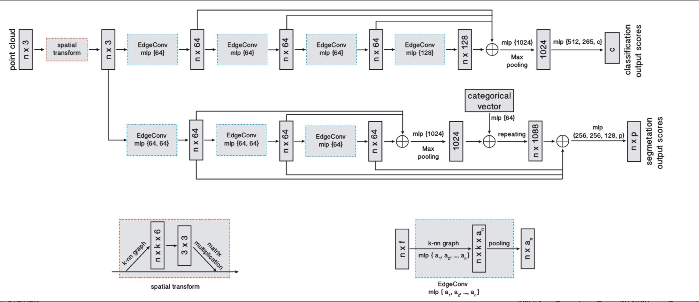
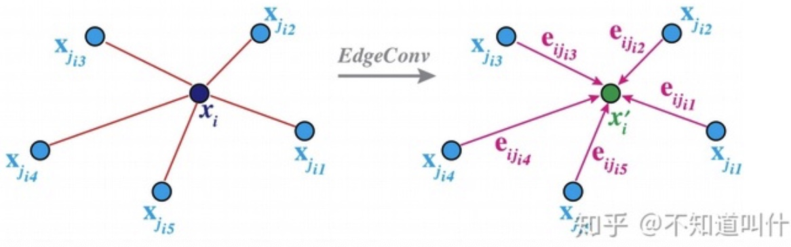
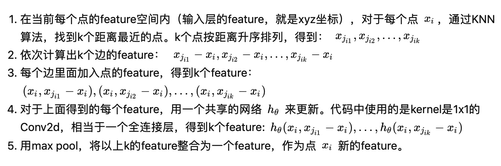

# 这篇文章就是在PointNet的基础上，提出了一种新的计算点云中的点的feature的算法，提升了点云分类/分割等任务的性能。

## 1.EdgeConv@2019

这里主要就是实现 对点云中节点的feature的更新操作，改进了Pointnet中缺少局部信息的缺点。

## Motivation
PointNet的主要流程是: 
1)先单独计算(更新)每个点的feature，更新了多次之后，最后用Global Pool将所有点的feature整合为一个点云的feature。（**在更新每个点的feature时，只与这个点之前的feature有关，与其它点的feature无关。**

2)作者认为每个点的feature在计算过程中彼此独立，每个都可以看作是一个全局feature，这可能就是一个值得大家去改进的地方。

## Details
edgeconv在计算每个点的feature时，不仅考虑这个点当前的feature，还考虑了在当前的feature空间内，
与当前点距离最近的K个点的feature。在feature空间内与目标点临近的K个点，可以在小范围内构成一个小的局部图。
1.@**从这个局部图计算出来的局部feature可以看作是一个局部feature）**

2.然后结合原始的Global Feature和局部的feature来做分类等任务或许有更好的结果。

**从点xi的feature更新过程来看，里面考虑了K个最近的邻居节点，并将K个点与Xi的距离作为更新feature的输入。因此可以说这个更新过程是xi的全局feature和局部feature共同决定的。**

### 所以本质上我们的EdgeConv是一种Dynamic Graph
我们都是使用KNN去找K个最近点，由于是按照新的feature计算的距离来找，所以每次KNN的结果都会不同，每次构建的局部图都会动态的更新。

如果把KNN找到的点，看作是receptive field。那么深层网络处，由于每层KNN的结构都不同，每个点的receptive field会越来越大。（**直觉上，这种方式可能更佳有利于全局feature的学习**）

